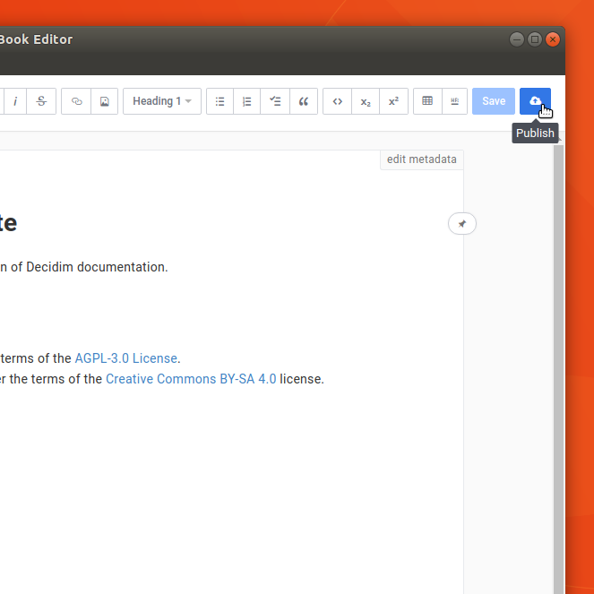
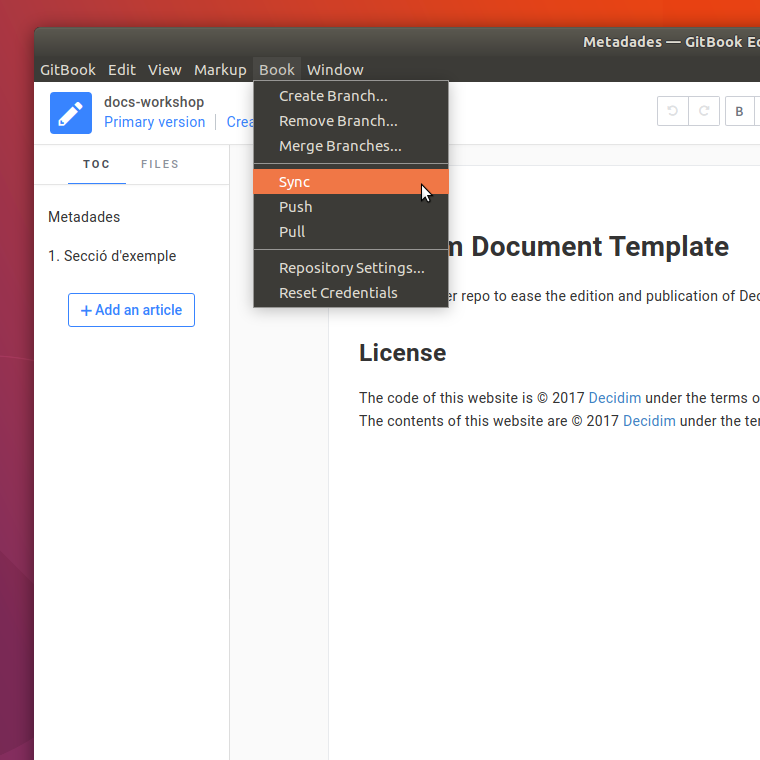
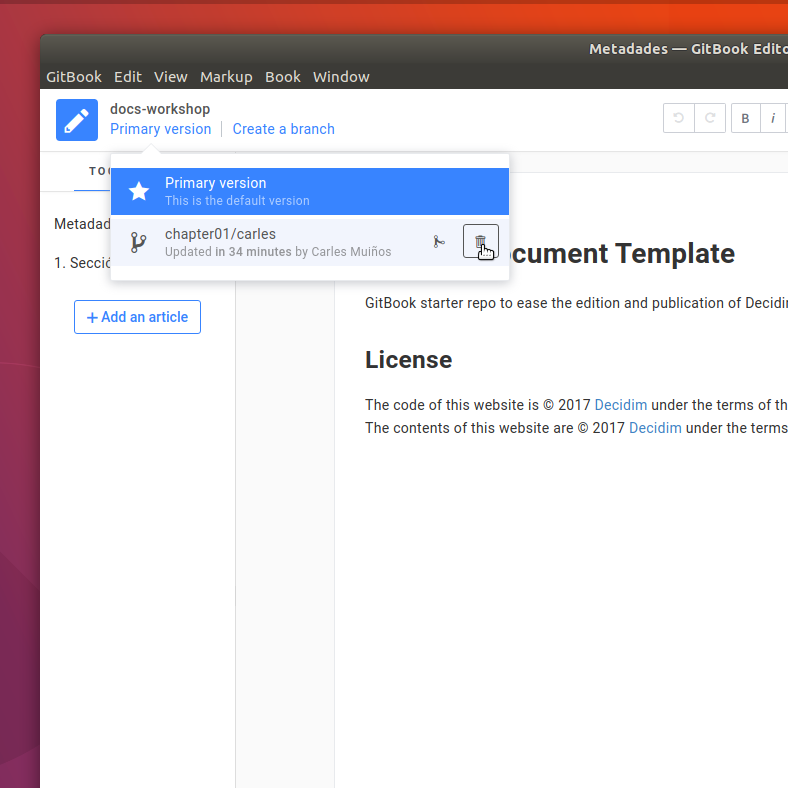

# Flux de treball (Power Writer)

### Preparació de l'entorn de treball

Abans de començar a treballar cal que preparem el directori que acollirà els documents
sobre els que farem les nostres contribucions. Obrim un terminal i executem la comanda següent:

```bash
$ mkdir -p ~/Documents/decidim-docs
```

A continuació demanarem a l'**Administradora de documentació** que ens afegeixi al grup de redactores de documentació (equip *docs*) a *GitHub*.

### Contribució a un document nou

Si volem afegir un document nou a la documentació del projecte haurem de demanar a l'**Administradora de documentació**
que prepari el repositori que l'allotjarà a *GitHub*.

Un cop l'**Administradora de documentació** ens doni el vist i plau podrem fer les nostres contribucions seguint les indicacions
de la secció següent.

### Contribució a un document ja existent

Com a **Redactores avançades** podem fer les nostres contribucions directament a *GitHub* sobre el repositori del document
(contribució online), o bé sobre una còpia local fent ús d'un editor (contribució offline), per exemple *Visual Studio Code*.

#### Contribucions online

#### Contribucions offline

Si és el primer cop que fem una contribució al document cal que preparem l'entorn de treball seguint les instruccions següents:

1. En un terminal ens situem al directori que ha d'allotjar el document.
```bash
$ cd ~/Documents/decidim-docs
```

2. [Clonem el repositori](https://help.github.com/articles/cloning-a-repository/) del document al que volem afegir la nostra contribució.
```bash
$ git clone https://github.com/decidim/docs-workshop.git
```

Per començar a fer les nostres contribucions al document cal seguir les indicacions següents:

1. En el terminal, ens situem al directori del document.
```bash
$ cd ~/Documents/decidim-docs/docs-workshop
```

2. Si no ho hem fet en una sessió de treball anterior, **abans de fer la nostra contribució** creem una branca per guardar els nostres canvis.
```bash
$ git checkout -b ca/chapter01/carles
```

3. A continuació obrim l'editor i fem les nostres contribucions.
```bash
$ code .
```

4. Un cop hàgim enllestit la sessió de treball i ara per ara no haguem de fer cap més canvi fem *commit* de les nostres contribucions.

   

4. Cada cop que guardem els canvis fets sobre el document l'editor ens demanarà que escrivim el comentari associat al *commit* que afegirà a l'històric del document.

   

8. Introduim les nostres credencials a *GitHub* quan l'editor ens ho demani.

   

9. Comuniquem a l'**Administradora de documentació** que hem fet la nostra contribució per a que pugui integrar els canvis a la branca principal  *master* del document.

10. Un cop l'administradora ens comuniqui que ha integrat els nostres canvis podrem sincronitzar la nostra còpia local. Seleccionem la branca principal com a branca de treball i fem *Sync* al menú *Book*.

    

11. Un cop els canvis s'hagin sincronitzat sense conflictes podrem esborrar la branca de treball que hem fet servir per a fer les nostres contribucions.

    


## Enllaços

- GitHub https://github.com/
- Visual Studio Code https://code.visualstudio.com/
