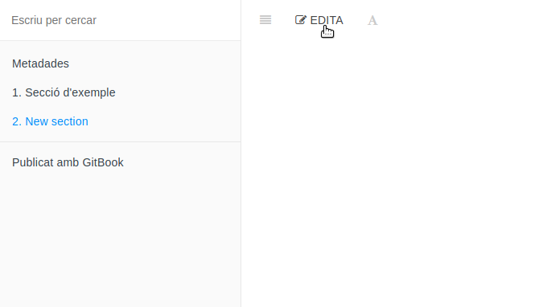
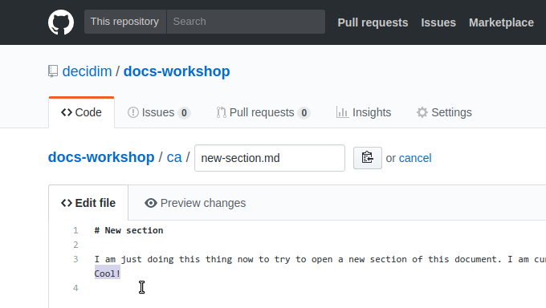
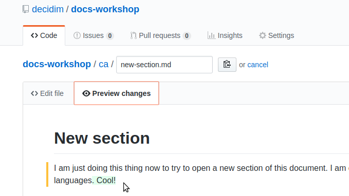
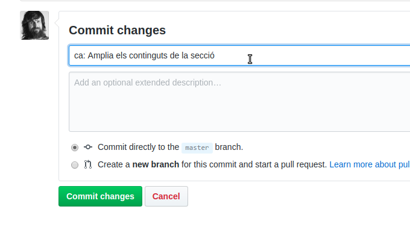
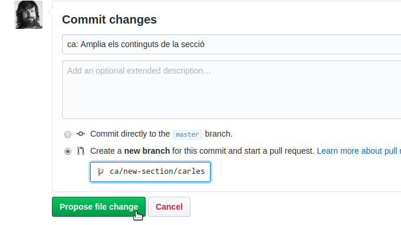
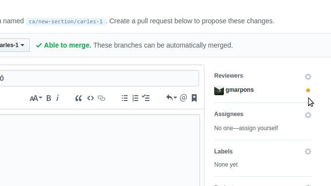
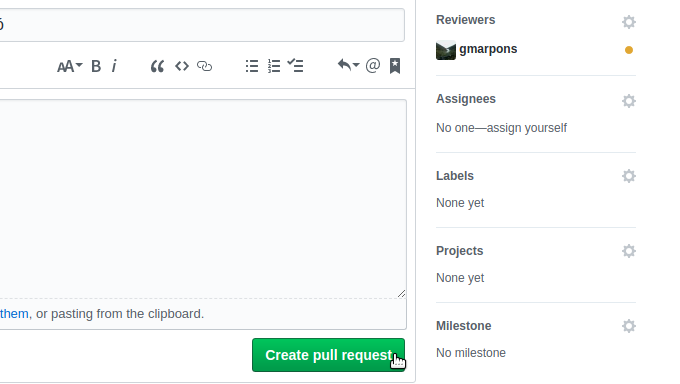
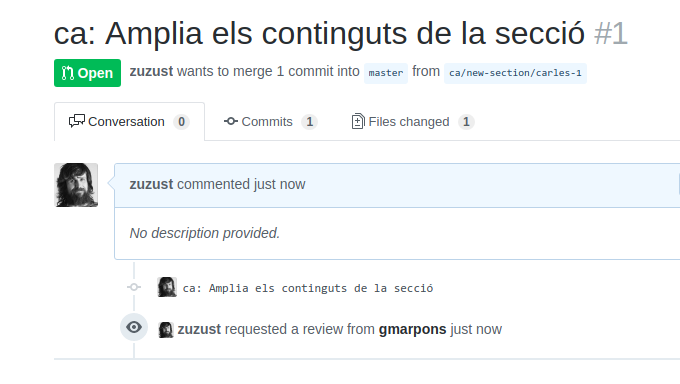
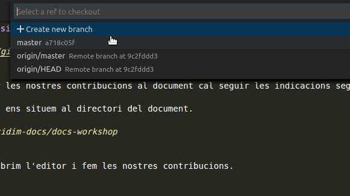
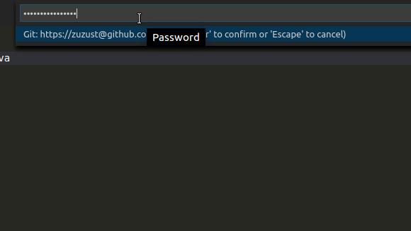

# Flux de treball (Power Writer)

### Preparació de l'entorn de treball

Abans de començar a treballar cal que preparem el directori que acollirà els documents
sobre els que farem les nostres contribucions. Obrim un terminal i executem la comanda següent:

```bash
mkdir -p ~/Documents/decidim-docs
```

A continuació demanarem a l'**Administradora de documentació** que ens afegeixi al grup de redactores de documentació (equip *docs*) a *GitHub*.

### Contribució a un document nou

Si volem afegir un document nou a la documentació del projecte haurem de demanar a l'**Administradora de documentació**
que prepari el repositori que l'allotjarà a *GitHub*.

Un cop l'**Administradora de documentació** ens doni el vist i plau podrem fer les nostres contribucions seguint les indicacions
de la secció següent.

### Contribució a un document ja existent

Com a **Redactores avançades** podem fer les nostres contribucions directament a *GitHub* sobre el repositori del document
(contribució online), o bé sobre una còpia local fent ús d'un editor (contribució offline), per exemple *Visual Studio Code*.

#### Contribucions online

Per poder fer una contribució directament sobre la còpia online del document cal seguir les indicacions següents:

1. Obrim al navegador la versió online del document.
2. Cliquem sobre el botó *Edita* de la part superior.

   

3. Fem les nostres contribucions a la pestanya *Edit file*.

   

4. Abans de donar per definitius els canvis fem una previsualització a la pestanya *Preview changes*.

   

5. Si tot és correcte escrivim el comentari associat al *commit* que s'afegirà a l'històric del document.

   

6. A continuació escrivim el nom de la branca on penjarà el nostre *commit* i iniciem un *Pull Request*.

   

7. Triem com a *Reviewer* una de les **Administradores de documentació**.

   

8. I finalment enviem un *Pull Request* per a que les nostres contribucions siguin integrades en la branca principal del document.

   
   

#### Contribucions offline

Si és el primer cop que fem una contribució al document cal que preparem l'entorn de treball seguint les instruccions següents:

1. En un terminal ens situem al directori que ha d'allotjar el document.
```bash
cd ~/Documents/decidim-docs
```

2. [Clonem el repositori](https://help.github.com/articles/cloning-a-repository/) del document al que volem afegir la nostra contribució.
```bash
git clone https://github.com/decidim/docs-workshop.git
```

Per començar a fer les nostres contribucions al document cal seguir les indicacions següents:

1. En el terminal, ens situem al directori del document.
```bash
cd ~/Documents/decidim-docs/docs-workshop
```

2. A continuació obrim l'editor.
```bash
code .
```

3. Si no ho hem fet en una sessió de treball anterior, **abans de fer la nostra contribució** creem una branca per guardar els nostres canvis.

   
   
   

4. Un cop fets els canvis sobre el fitxer de treball fem *commit* de les nostres contribucions. Per fer-ho,

   canviem a la vista de control de versions,
   

   a continuació fem *commit*,
   

   responem afirmativament a la qüestió plantejada per l'editor
   

   i escrivim el comentari associat al commit que l'editor afegirà a l'històric del document.
   

5. Un cop hàgim enllestit la sessió de treball i ara per ara no haguem de fer cap més canvi publiquem les nostres contribucions.

   
   

6. Introduim les nostres credencials a *GitHub* quan l'editor ens ho demani.

   
   

7. Comuniquem a l'**Administradora de documentació** que hem fet la nostra contribució per a que pugui integrar els canvis a la branca principal  *master* del document.

8. Un cop l'administradora ens comuniqui que ha integrat els nostres canvis podrem sincronitzar la nostra còpia local. Per fer-ho, seleccionem la branca *master* com a branca de treball i fem *Sync* al menú

    
    
    

9. Un cop els canvis s'hagin sincronitzat sense conflictes podrem esborrar la branca de treball que hem fet servir per a fer les nostres contribucions. Per fer-ho,

    obrim la caixa de comandes amb la combinació *Ctrl+Shift+P*, escrivim la comanda *Git: Delete branch*
    

    i seleccionem la branca de treball que volem esborrar
    

##### Treballant a la línia de comandes

Totes les accions descrites tenen d'equivalents a la línia de comandes. Si [obrim el terminal integrat de l'editor](https://code.visualstudio.com/docs/editor/integrated-terminal) també podrem publicar les nostres contribucions:

1. Creem la branca de treball.
```bash
git checkout -b ca/flux-power-writer/carles
```

2. Un cop fets els canvis sobre el fitxer de treball fem *commit* de les nostres contribucions.
```bash
git add .
git commit -m "ca: Actualitza la secció *Contribucions offline* del capítol *Flux de treball (Power Writer)*"
```

3. Si hem enllestit la sessió de treball i ara per ara no hem de fer cap més canvi publiquem les nostres contribucions.
```bash
git push origin ca/flux-power-writer/carles
```

4. Un cop l'administradora ens comuniqui que ha integrat els nostres canvis podrem sincronitzar la nostra còpia local.
```bash
git checkout master
git pull
```

5. Quan els canvis s'hagin sincronitzat sense conflictes podrem esborrar la branca de treball que hem fet servir per a fer les nostres contribucions.
```bash
git branch -d ca/flux-power-writer/carles
```


## Enllaços

- GitHub https://github.com/
- Cloning a repository https://help.github.com/articles/cloning-a-repository/
- Git Cheat Sheet https://services.github.com/on-demand/downloads/github-git-cheat-sheet.pdf
- Visual Studio Code https://code.visualstudio.com/
- Integrated Terminal https://code.visualstudio.com/docs/editor/integrated-terminal
