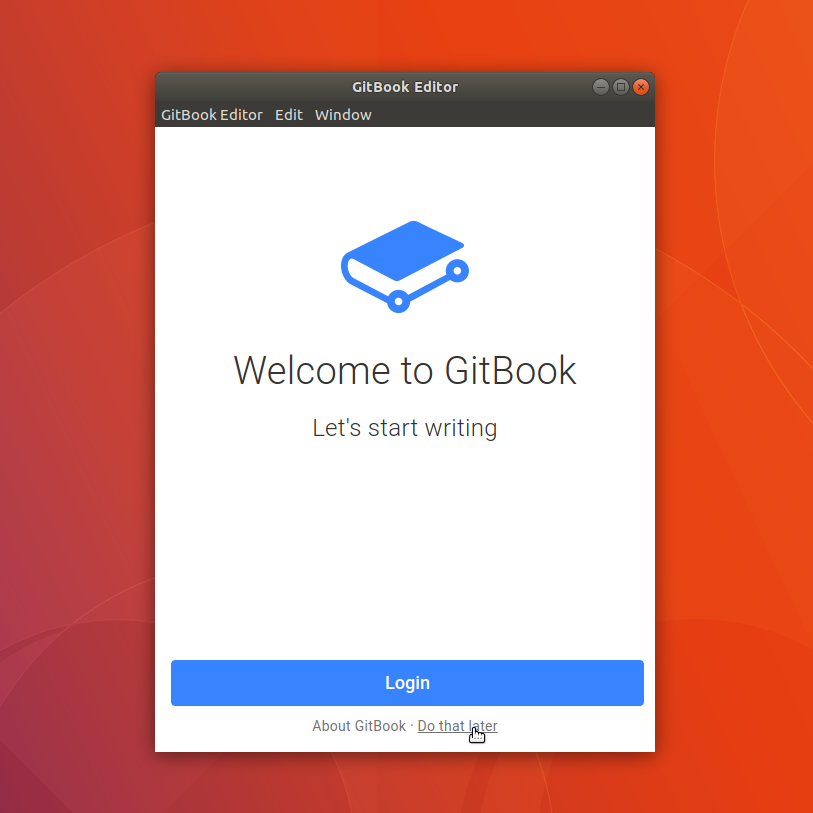
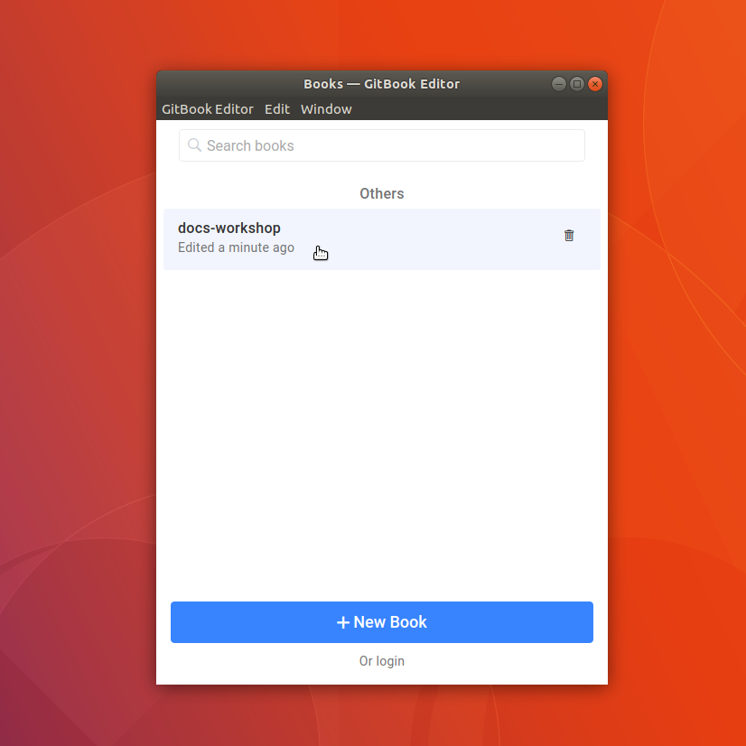
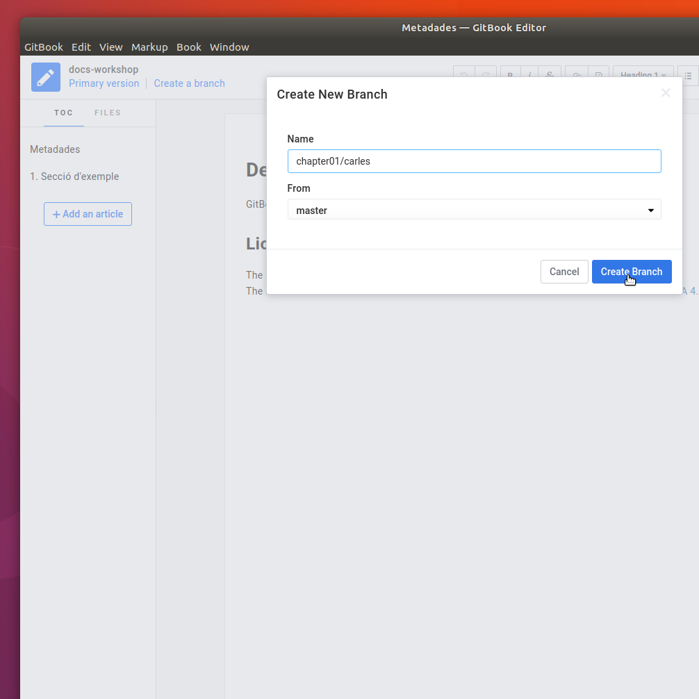
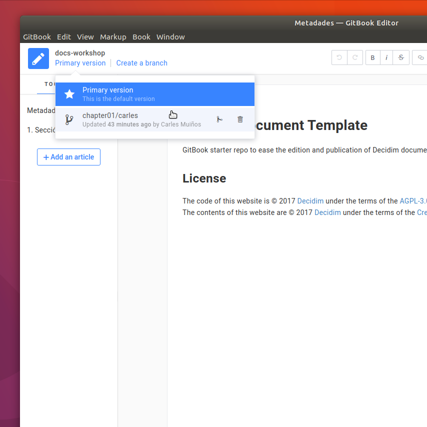
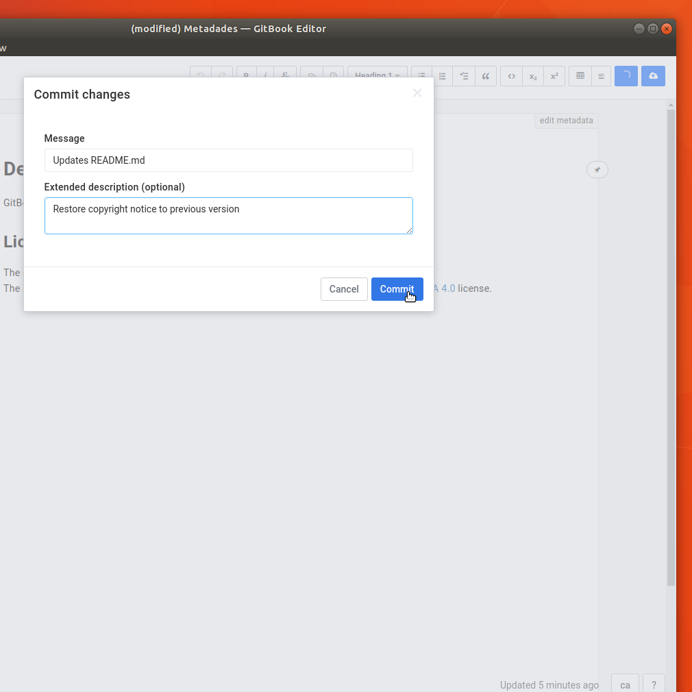
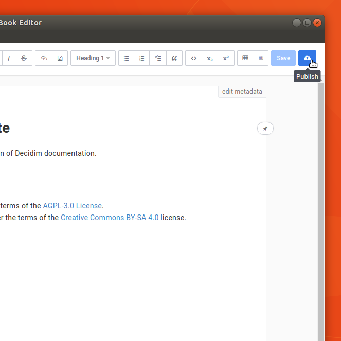
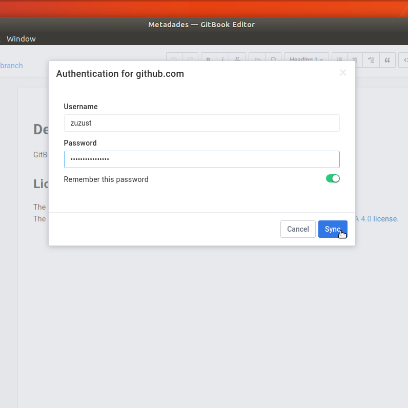
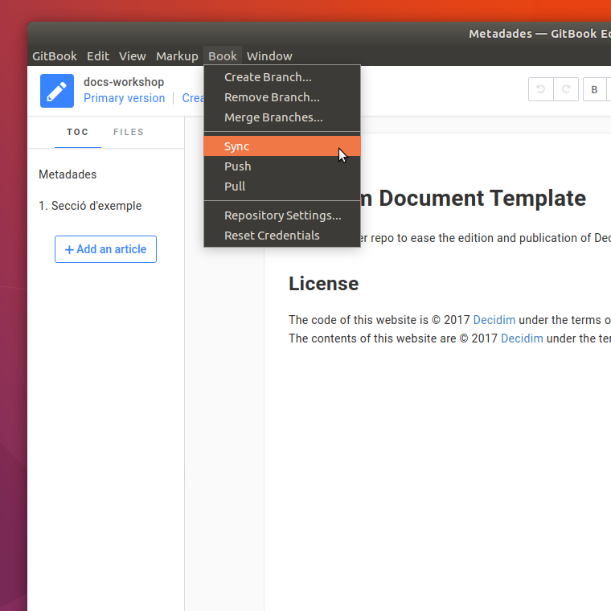
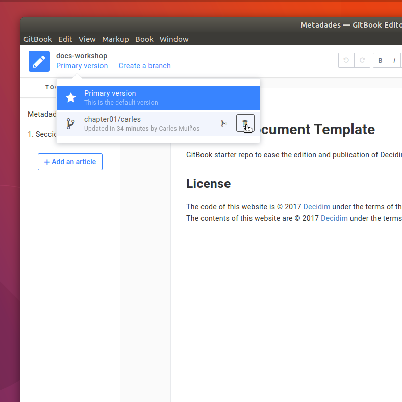

# Flux de treball

1. Obriu un terminal i creeu, si no ho heu fet amb anterioritat, el directori que allotjarà els documents
```bash
$ mkdir -p GitBook/Library/Imports
```

2. Cambieu al directori que ha d'allotjar els documents
```bash
$ cd && cd GitBook/Library/Imports
```

3. Cloneu, si no ho heu fet amb anterioritat, el repositori del document al que voleu afegir la vostra contribució
```bash
$ git clone https://github.com/decidim/docs-workshop.git
```

4. Inicieu el *GitBook Editor*

5. A la finestra d'inici cliqueu sobre l'enllaç *Do that later*

   

6. Seleccioneu el document sobre el que voleu treballar

  

6. Un cop obert, i **abans de fer la vostra contribució**, creeu una branca per guardar els vostres canvis

   

7. A continuació seleccioneu la branca de treball i feu les vostres contribucions

   

8. Cada cop que guardeu els canvis fets sobre el document l'editor us demanarà que escriviu el comentari associat al *commit* que afegirà a l'històric del document

   

9. Un cop hàgiu enllestit la sessió de treball i ara per ara no hagueu de fer cap més canvi publiqueu les vostres contribucions

   

10. Introduiu les vostres credencials a GitHub quan l'editor us ho demani

   

11. Comuniqueu a l'administradora de documentació que heu fet la vostra contribució per a que pugui integrar els canvis a la branca principal  *master* del document

12. Un cop l'administradora us comuniqui que ha integrat els vostres canvis podreu sincronitzar la vostra còpia local. Seleccioneu la branca principal com a branca de treball, feu *Sync* al menú *Book*

    

13. Un cop els canvis s'hagin sincronitzat sense conflictes podreu esborrar la branca de treball que heu fet servir per a fer les vostres contribucions

    

